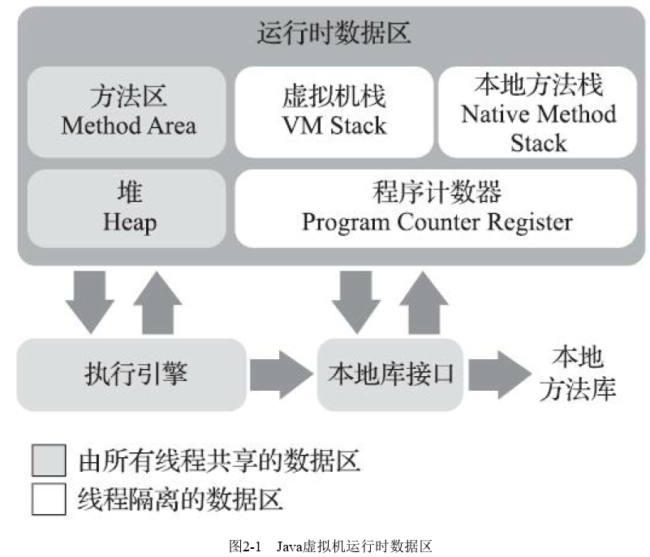

#### 程序计数器

是当前线程所执行的字节码的行号指示器。在Java虚拟机的概念模型里，字节码解释器工作时就是改变这个计数器的值来选取下一条需要执行的字节码指令，他是程序控制流的指示器，分支、循环、跳转、异常处理、线程恢复等基础功能都需要依赖这个计数器完成
是线程私有的，Java多线程是通过线程轮流切换、分配处理器执行时间的方式来实现的，在任何一个确定的时刻，一个处理器都只会执行一条线程中的指令。因此为了线程切换后能恢复到正确的执行位置，每个线程都有一个独立的程序计数器，个线程间互不影响，独立存储

#### Java虚拟机栈

是线程私有的，并伴随线程的生命周期。在Java虚拟机的概念模型中，每个方法被执行时，Java虚拟机都会同步创建一个栈帧，用于存储局部变量表、操作数栈、动态连接、方法出口等信息。每一个被调用至执行完毕的过程都对应着一个栈帧在虚拟机中从入栈到出栈的过程
局部变量表存放了编译器可知的各种Java虚拟机基本数据类型、对象引用和return Address类型。这些数据类型在局部变量表中的存储空间以局部变量槽来表示，其中64位长度的long和double类型的数据会占用两个变量槽，其余均占用一个。局部变量表所需要的空间时完全确定的，在方法运行期间不会改变局部变量表的大小
可能出现的异常状况：
1.线程请求的栈深度大于虚拟机允许的深度，会抛出StackOverflowError异常；
2.当线程申请栈空间失败，无法获得足够的内存会抛OutOfMemoryError异常

#### 本地方法栈

虚拟机栈为虚拟机执行Java方法服务，本地方法栈为虚拟机使用到本地方法服务
可能出现的异常状况同虚拟机栈一样，StackOverflowError和OutOfMemoryError

#### Java堆

是被线程共享的一块内存区域，随虚拟机启动而创建。是虚拟机所管理的内存中最大的一块，用于存对象的实例，几乎所有的Java对象实例都在这里分配内存。
Java堆是垃圾收集器管理的内存区域，该区域也被称为GC堆
Java堆既可以被实现成固定大小的，也可以是扩展的，目前主流Java虚拟机都是按照可扩展来实现的（通过参数-Xms和-Xmx设置）。如果堆中没有内存完成实例分配，且堆无法再扩展时会抛出OutOfMemoryError

#### 方法区

是线程共享的内存区域，用于存储已被虚拟机加载的类型信息、常量、静态变量、即使编译器编译后的代码缓存等数据，作为堆的一个逻辑部分，因此它有一个别名“非堆”
JDK8以前使用永久代来实现方法区，考虑到HotSpot未来的发展，在JDK6时开发团队放弃永久代，逐步改为采用本地内存来实现方法区，在JDK7已经把原本放在永久代的字符串常量池、静态变量等移出，而到了JDK8时完全废弃了永久代，改用本地内存中实现的元空间来代替
若方法区无法满足新的内存分配需求，将抛出OutOfMemoryError

#### 运行时常量池

是方法区的一部分，Class文件中除了有类的版本、字段、方法、接口等描述信息外，还有一项信息是常量池表，用于存放编译期生成的各种字面量与符号引用
运行时常量池具备动态性，不要求常量一定只有编译器才能产生，也就是说，在运行期间也可以将常量放入池中，如String的intern()方法
常量池是方法区的一部分，自然受方法区内存限制，当无法在申请到内存时将抛出OutOfMemoryError

#### 直接内存

并不是虚拟机运行时数据区的一部分，也不是《Java虚拟机规范》中定义的内存区域，但这部分内存也会被频繁使用，且可能导致OutOfMemoryError
JDK1.4引入NIO类，引入了基于通道与缓冲区的IO方式，它可以使用Native函数库直接分配堆外内存，然后通过一个存储在Java堆里面的DirectByteBuffered对象作为这块内存的引用进行操作，这样能显著提高性能，因为避免了Java堆与Native堆中来回复制数据。显然本机直接内存不会受Java堆的限制，但肯定会受到机器总内存大小及处理器寻址空间的限制，一般服务器管理员配置虚拟参数时会根据内存去设置-Xmx参数信息，但经常忽略直接内存，使得各个内存区域总和大于物理内存限制，从而导致动态扩展时出现OutOfMemoryError

#### 对象的创建

在语言层面，创建对象通常仅仅是new关键字而已，而虚拟机中，对象的创建过程如下：
1.类加载检查：当虚拟机遇到一条字节码new指令时，首先检查这个指令的参数是否能在常量池中定位到一个类的符号引用，并检查这个符号引用代表的类是否已被加载、解析和初始化过。如果没有那么必须先执行相应的类加载过程
2.在类加载检查后，将为新生对象分配内存，其所需大小在类加载完成后便可完全确定。
分配内存分为两种方法：
a.指针碰撞（Bump The Pointer）：堆中内存绝对规整，所有使用过内存都被放在一边，空闲的放在另一边，中间放置一个指针作为分界点，分配内存仅仅就是把指针向空闲内存方向移动对应大小的距离
b.空闲列表（Free List）：如果内存并不规整，使用的与空闲的交错在一起，虚拟机就必须维护一个列表，记录哪些可用的，在分配时从列表中找到一块足够大的空间划分给对象实例，并更新记录列表

对象创建在虚拟机中是非常频繁的行为，即使仅仅修改一个指针所指向的位置，在并发情况下也不是线程安全的，可能在给A分配内存，指针还没来得及修改，对象B又同时使用了原来分配的指针分配内存。解决这个问题有两个可选方案：
a.对内存空间的动作进行同步处理，实际上虚拟机是采用CAS配上失败重试的方式保证更新操作的原子性
b.把内存分配的动作按照线程划分在不同空间中进行，每个线程在堆中预先分配一块小内存，称为本地线程分配缓冲（Thread Local Allocation Buffer，TLAB），对应线程调用对应的本地线程缓冲区，只有当缓冲区用完了，分配新的缓存区时才需要同步锁定。是否使用TLAB可使用-XX：+/-UseTLAB来设置

3.上面工作完成后，从虚拟机视角来看，一个新的对象已经产生，但从Java程序的来看对象才刚刚开始——构造函数，即Class文件中<init>()方法还没有执行，所有字段都还是默认的零值

#### 对象的内存布局

对象在堆内存中的存储布局分为三个部分：对象头、实例数据和对齐填充
对象头包括两类信息：
1.用于存储对象自身的运行时数据（哈希码、GC分代年龄、锁状态、线程持有的锁、偏向线程ID、偏向时间戳等），这部分数据长度在位于32位和64位虚拟机中分别对应32比特和64比特
2.类型指针，即对象指向它的类型元数据的指针，Java虚拟机通过这个指针来确定该对象是哪个类的实例
实例数据是对象正真存储的有效信息，即在程序中所定义的各种类型的字段内容，无论是父类继承下来的，还是在子类中定义的字段都必须记录起来。这部分的存储顺序受虚拟机分配策略和字段在源码中定义的顺序的影响
对齐填充，并不是必然存在的，也没有特别含义，仅仅起着占位符的作用。HotSpot虚拟机的自动内存管理系统要求对象起始地址必须是8字节的整数倍，对象头部分被设计成正好是8字节的倍数，因此如果对象实例数据部分没有对齐的话，就需要通过对齐填充来补全

#### 对象的访问定位

主流的访问方式主要使用句柄和直接指针

