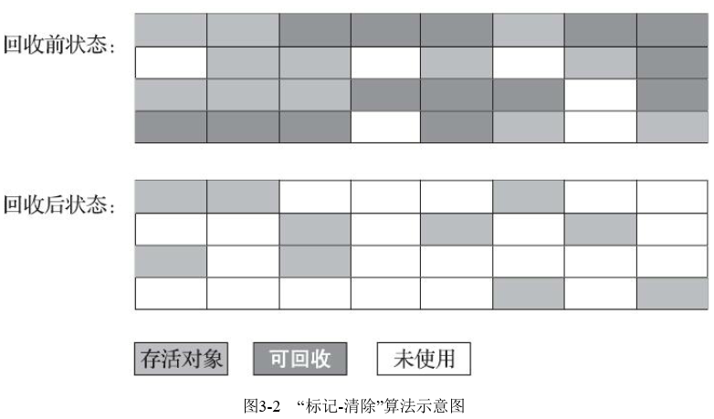
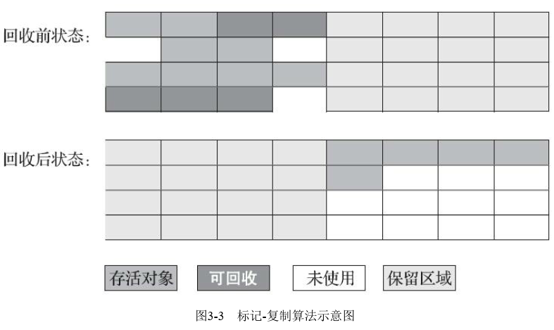
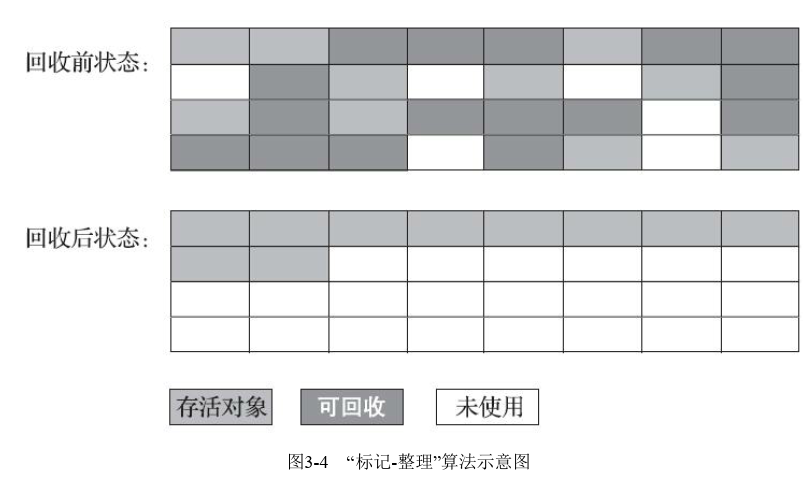

垃圾收集算法
分为引用计数式垃圾收集（Refereence Counting GC）和追踪式垃圾收集（Tracing GC），Java使用的均属于追踪式垃圾收集范畴

分代收集理论，实质是一套符号大多数程序运行实际情况的经验法则，建立在两个分代假说之上
1.弱分代假说（Weak Generational Hypothesis）：绝大多数对象都是朝生夕灭的
2.强分代假说（Strong Generational Hypothesis）：熬过越多次垃圾收集过程的对象就越难以消亡
这两个假说共同奠定了多款常用的垃圾收集器的一致的设计原则：收集器应该将Java堆划分出不同的区域，然后将回收对象依据年龄分配到不同的区域之中存储

划分区域的好处：如果一个区域中大多数对象是朝生夕灭，难以熬过垃圾收集过程的话，那么集中在一起，每次回收只关注如何保留少量存活而不是标记那些大量将要回收的对象，就能以较低代价回收大量空间；如何一个区域都是难以消亡的对象，那么集中在一块，虚拟机就能使用较低频率来回收这个区域，这就同时兼顾了垃圾收集的时间开销和内存的空间有效利用

结合反代收集理论Java虚拟机一般会把堆划分为新生代和老年代两个区域，但假设此时要进行一次局限于新生代区域的收集，但新生代中的对象完全有可能被老年代所引用，为了找出该区域中存活对象，不得不在固定的GC Roots之外，再额外遍历整个老年代中所有对象来确保可达性分析的结果，反过来也一样。遍历整个老年代所有对象理论上可行，但无疑给回收带来很大的性能负担，为了解决这个问题，就需要对分代理论添加第三条经验法则：
3.跨代引用假说（Intergeneration Reference Hypothesis）：跨代引用对于同代引用来说仅占用极少数
依据这条假说，就不必在为了少量的跨代引用去扫描整个老年代，也不必浪费空间专门记录每个对象是否存在及存在哪些跨代引用，只需要在新生代上建立一个全局的数据结构（记忆集Remembered Set），这个结构把老年代划分成若干小块，标识出哪块内存会存在跨代引用，此后当发生Minor GC时，只有包含了跨代引用的小块内存中的对象才会被加入到GC Roots进行扫描。

Partial GC：指目标不是完整收集整个Java堆的垃圾收集，其中又分为：
1.Minor GC/Young GC：指目标只是新生代的垃圾收集
2.Major GC/Old GC：指目标只是老年代的垃圾收集（目前只有CMS有单独收集老年代的行为）
3.Mixed GC：指目标是收集整个新生代以及部分老年代的垃圾收集（目前只有G1收集器有这种行为）
4.Full GC：指整个Java堆和方法区的垃圾收集

标记-清除算法
分为标记和清除两个阶段：首先标记出所需要回收的对象，在标记完成后，统一回收掉所有被标记的对象，也可反过来。是最基本的收集算法，后续的收集算法大多以此为基础，对其缺点进行改进而得到的。
主要有两个缺点：1.执行效率不稳定，如果堆中存在大量对象且其中大部分需要回收，此时必须做出大量标记和清理动作，导致标记和清理两个过程的执行效率随对象数量增长而降低。2.内存空间碎片化问题，标记清除后会产生大量不连续的内存碎片，空间碎片太多可能会导致以后在程序运行过程中需要分配较大对象时无法找到足够的连续内存而不得不提交触发另一次回收动作

标记-复制算法
为解决标记-清除算法面对大量可回收对象时执行效率低的问题，它将可用内存按容量划分为大小相等的两块，每次仅用其中一块，当这一块用完了，将还存活着的对象复制到另一块上面，然后再把已用过的内存空间一次性清理掉。但如果内存中的对象都是存活的，这种算法会产生大量内存间复制的开销，但对于多睡对象都是可回收的情况，算法需要复制的就是占少数的存活对象，而且每次都是针对整个半区进行内存回收，分配内存时也不用考虑有内存碎片的清理。
该算法实现简单、运行高效，不过代价是将可用内存缩小为原来的一半，空间浪费极大
目前商用Java虚拟机大多采用该算法去回收新生代。具体做法是把新生代分为较大的Eden空间和两块较小的Survivor空间，每次分配内存只使用Eden和一块Survivor，进行垃圾收集时，将Eden和Survivor中任存活的对象一次性复制到另一块Survivor上，然后清理Eden和使用中的Survivor空间。Eden和Survivor默认的大小比例为8：1。即每次新生代中可用内存空间为整个新生代容量的90%。当垃圾回收时，Survivor空间不足以容纳一次Minor GC后存活的对象时，就需要依赖其他内存区域（大多数是老年代）进行分配担保

标记-整理算法
针对老年代对象的存亡特征，提出了标记-整理算法，其标记过程同标记-清除算法一样，但后续步骤不是直接对可回收对象进行清理，而是让所有存活对象都向内存空间一端移动，然后直接清理掉边界外的内存

