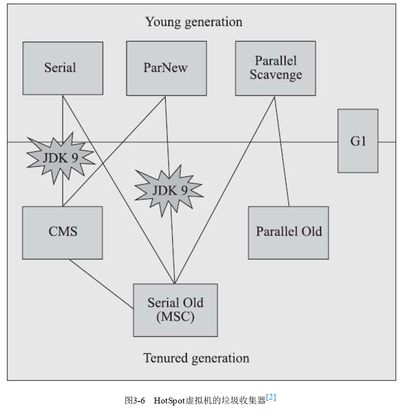

经典垃圾收集器

图中两个收集器间存在连线，就说明它们可用搭配使用

##### 1.Serial收集器

是最基础、历史悠久的收集器。这个收集器是一个单线程工作的收集器，在进行垃圾收集时，必须暂停其他所有工作线程，直到收集结束（Stop The World）

至今为止，它依旧时HotSpot虚拟机运行在客户端模式下的默认新生代收集器，有着优于其他收集器的地方，那就是简单而高效，对于内存资源受限的环境，它是所有收集器里额外内存消耗（Memory Footprint）最小的；对于单核处理器或处理器核心数较少的环境来说，由于没有线程交互的开销，专心做垃圾收集自然可以获得较高的单线程收集效率

##### 2.ParNew收集器

实质上是Serial收集器的多线程并行版本，除了同时使用多条线程进行垃圾收集之外，其余的行为包括Serial收集器可用的所有控制参数、收集算法、Stop The World、对象分配规则、回收策略等都与Serial完全一致

JDK7前遗留系统中首选的新生代收集器，其中有一个与性能、功能无关但其实很重要的原因：除了Serial处理器外，目前只有它能与CMS收集器配合工作。但随着G1收集器的出现，ParNew加CMS的组合就不再是官方推荐的服务端模式下的收集器解决方案了
ParNew收集器是激活CMS后（-XX:：+UseConcMarkSweepGC选项）的默认新生代收集器，可以使用-XX：+/-UseParNewGC选项来强制指定或禁用，使用-XX：ParalleGCThreads参数限制垃圾收集的线程数

##### 3.Parallel Scavenge收集器

也是一款新生代收集器，同样是基于标记-复制算法实现的收集器，也能并行收集的多线程收集器
Parallel Scavenge收集器的特点是关注点与其他收集器不同，CMS等收集器关注是尽可能的缩短垃圾收集器时用户线程的停顿时间，而该收集器的目标是达到一个可控制的吞吐量。吞吐量就是处理器用于运行用户代码的时间与处理器总耗时的比值。

Parallel Scavenge提供了两个用于精确控制吞吐量
1.最大垃圾收集停顿时间：-XX：MaxGCPauseMillis：参数允许一个大于0的毫秒数，收集器尽力保证内存回收花费时间不超过该值。把这个值设置得小一点不意味着垃圾收集的更快，垃圾收集停顿时间的缩短是以牺牲吞吐量和新生代空间为代价的。系统把新生代调小些，收集200MB新生代肯定快于500MB，但也导致垃圾收集更频繁，原理10s收集一次，每次停顿100ms，现在5s收集一次，每次停顿70ms，停顿时间下降了，但吞吐量也降低了

2.吞吐量大小：-XX：GCTimeRatio：参数允许一个大于0小于100的整数，也就是垃圾收集时间占用总时间的比率，如设置为19，那允许最大垃圾收器时间就占总时间的5%（1/（1+19））；默认为99，即1%（1/（1+99））

还有一个-XX：+UseAdaptiveSizePolicy参数，这是一个开关参数，当这个参数激活后，就不需要人工指定新生代大小、Eden与Survivor区域的比例、晋升2老年代对象大小等细节参数了。此时虚拟机会根据当前系统的运行情况收集性能监控信息，动态调整这些参数以提供最合适的停顿时间或最大的吞吐量。这种调节方式被称为垃圾收集的自适应的调节2策略

##### 4.Serial Old收集器

是Serial收集器的老年代版本，同样是一个单线程收集器，使用标记-整理算法。这种收集器的主要意义也是供客户端模式下的HotSpot虚拟机使用；如果在服务端模式下，它具有两种用途：a.在JDK5之前的版本中与Parallel Scavenge收集器搭配使用；b.作为CMS收集器发生失败的后备预案

##### 5.Parallel Old收集器

是Paralled Scavenge的老年代版本，支持多线程并非收集，基于标记-整理算法实现

##### 6.CMS收集器

Concurrent Mark Sweep是一种以获取最短回收停顿时间为目标的收集器。基于标记-清除算法实现的，整个过程分为四步：
1.初始标记 ：需Stop The World，初始标记仅仅是标记下GC Roots能直接关联到的对象，速度很快
2.并发标记 ：从GC Roots的直接关联对象开始遍历整个对象图的过程，过程耗时较长但不需要停顿用户线程，可以与垃圾收集器线程一起并发运行
3.重新标记 ：需Stop The World，为了修正并非标记期间，因用户程序继续运行而导致标记产生变动的那部分对象的标记记录，这个阶段停顿时间通常比初始标记稍长，但也远比并发标记短
4.并非清除：清理删除掉标记阶段判断已死亡的对象，由于不需要移动存活对象，这个阶段是可以与用户线程同时并发的

CMS的优点：并发收集、低停顿
缺点：
1.对处理器资源非常敏感。在并发阶段，同用户线程一同并发运行导致应用程序变慢，降低总吞吐量。CMS默认启动回收线程数是（处理器核心线程数+3）/4，就是说处理器核心数在四个或以上，并发回收时垃圾收集器只占用不超过25%的运算资源，并随核心数增加而降低；但当核心不足四个时，CMS对程序影响就变得很大，为了缓解这种情况，虚拟机提出了一种增量式并发收集器（Incremental Concurrent Mark Sweep/i-CMS）的CMS收集器变种，但已被废弃
2.无法处理浮动垃圾，有可能出现“Concurrent Mode Failure”失败进而导致另一次完全的“Stop The World”的Full GC的产生。在并发标记与并发清理阶段，用户线程还在运行，会伴随新的垃圾对象不断产生，但这一部分垃圾对象是出现在标记过程结束之后，CMS无法在当次收集中处理掉它们，只能留到下一次收集，这部分垃圾就是浮动垃圾。
3.CMS基于标记-清除算法，意味着收集结束后会有大量空间碎片。如果在分配内存时无法找到足够大的连续空间就不得不提前触发一次Full GC，为解决这个问题，提供了-XX：+UseCMS-CompactrAtFullCollection开关参数用于内存整理存活对象，但这样停顿时间又会变长，因此又提供了一个参数-XX：CMSFullGCsBeforeCompaction用于要求CMS在执行若干次不整理空间的Full GC后，下一次进入Full GC前会进行碎片整理（默认0，表示每次）。以上两个参数从JDK9开始废弃

##### 7.Garbage First收集器

简称G1收集器，是垃圾收集器技术发展历史上里程碑式的成果，开创了收集器面向局部收集的设计思路和基于Region的内存布局形式。
G1是面向服务端应用的垃圾收集器，从JDK9开始作为默认的服务端垃圾收集器，是CMS收集器的替代者和继承人。G1收集器前的所有其他收集器垃圾收集的目标范围要么是整个新生代，或老年代，或整个堆；而G1则面向堆内存任何部分来组成回收集进行回收，衡量标准不再是属于哪个分代，而是哪块内存中存放的垃圾数量最多，回收收益最大，这就是G1收集器的Mixed GC模式
G1实现了停顿时间模型的收集器，具体意思是能够支持指定在长度为M毫秒的时间段内，消耗在垃圾收集器上的时间大概率不超过N毫秒
G1仍遵守分代收集理论设计，但其堆内存的布局同其他收集器有很大的差异，G1不再坚持固定大小及固定数量的分代区域划分，而是把连续的Java堆划分成多个大小相等的独立区域（Region），每个区域都可根据需要扮演Eden空间，Survivor空间或老年代空间，G1对扮演不同角色的区域采用不同策略出处理，这样无论是新创建对象还是已经存活的对象都能左到很好的收集效果
Region中还有一类特殊Humongous区域，专用存储大对象，只有超过一个Region容量一半的对象即可判定为大对象，Region大小通过-XX：G1HeapRegionSize设置，取值范围1MB-32MB，且为2的N次幂。对于超过整个Regin的超大对象，将会被存放在N个连续的Humongous Region中，G1的大多数行为都把Humongous Region作为老年代的一部分进行看待
G1保留新生代与老年代概念，但其不再是固定的了，都是一系列区域（不需要连续）的动态集合。G1收集器之所以能建立可预测的停顿时间模型，是因为它将Region作为单次回收的最小单元，即每次收集到的内存空间都是Region大小的整数倍，这样可以有计划的避免在整个Java堆中进行全区域的垃圾收集。更具体的来说是让G1收集器跟踪各个Region中的垃圾堆积的价值大小，价值即回收所获得的空间大小及回收所需时间的经验值，然后在后台维护一个优先级列表，每次根据用户设定允许的收集停顿时间，优先处理回收价值收益最大的那些Region
G1收集器运行过程大致分为4步：
1.初始标记：仅标记GC Roots能直接关联到的对象，并修改TAMS指针的指，让下一阶段用户线程并发运行时，能正确地在可用Region中分配新对象
2.并发标记：从GC Roots开始对堆中对象进行可达性分析，递归扫描整个堆中的对象图，找出要回收的对象，扫描完成后，还要重新处理SATB记录下的在并发时有引用变动的对象
3.最终标记：对用户线程做另一个短暂的暂停，用于处理并发阶段结束后遗留下来的最后那少量的SATB记录
4.筛选回收：负责更新Region的统计数据，对各个Region的回收价值和成本进行排序，根据用户所期望的停顿时间来制定回收计划，可以自由选择任意多个Region构成会收集，然后把决定回收的那部分Region的存活对象复制到空Region中，再清理掉旧的整个空间

