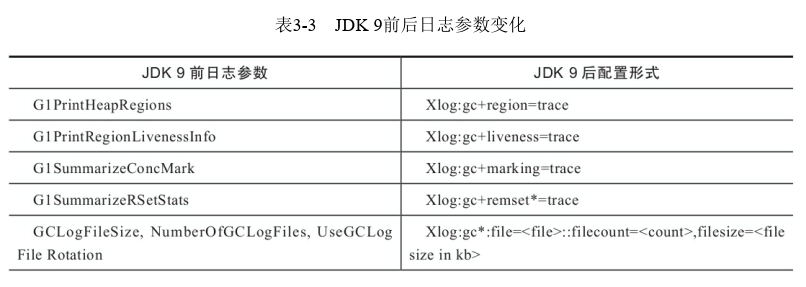
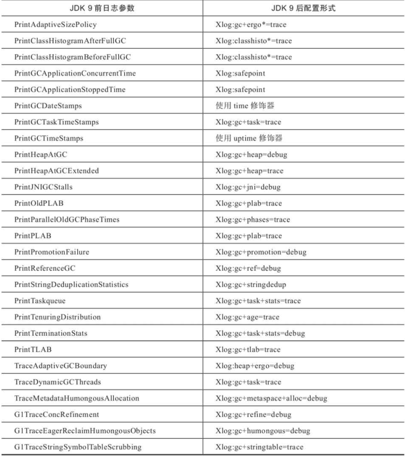
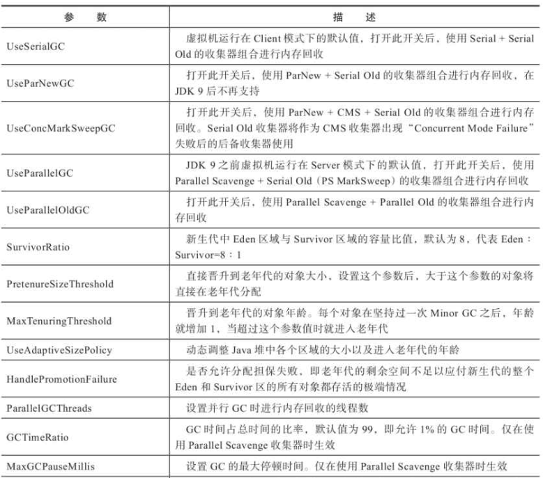
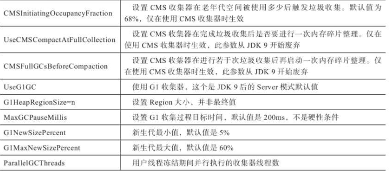
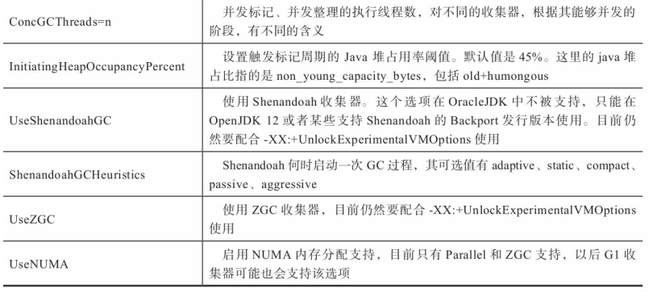

选择合适的垃圾收集器

1.Epsilon收集器

是一个无操作的收集器，更贴切的说是自动内存管理子系统。从JDK10开始，为了隔离垃圾收集器与Java虚拟机解释、编译、监控等子系统的关系，RedHat提出额垃圾收集器的统一接口，即JEP304天，Epsilon是这个接口的有效性验证和参考实现，同时也用于需要剥离垃圾收集器影响的性能测试和压力测试

2.收集器的权衡

如何选择一款适合应用的收集器呢，主要受三个因素影响：
a.应用程序的主要关注点：如数据分析、科学计算类的任务，目标是尽快算出结果，那吞吐量是关注点；如SLA应用，那停顿时间直接影响服务质量，那延迟就是关注点；如客户端或嵌入式，那内存占用就是关注点
b.运行应用的基础设施：如硬件规格、涉及系统架构、处理器数量、分配内存大小、操作系统等
c.使用的JDK发行版本是什么

3.虚拟机及垃圾收集器日志

在JDK9之前，HotSpot并未提供统一的日志处理框架

4.垃圾收集器参数总结

